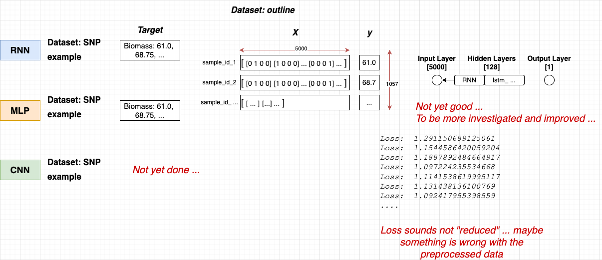

## Deep Nerual Networks for Phenotype Prediction

This project is about trying and testing deep neural networks for predicting phenotype from genotype datasets. The target is a comparison between classical machine learning models and deep neural network models in phenotype prediction. The following summarizes how the datasets look like and which models are used in this project.

### Played around with RNN, CNN, MLP and sample datasets

Have tried to get familiar with RNN, CNN, MLP implemented by Pytorch. The sample datasets that I have used as follows


### Review an SNP dataset example: from the lecture Introduction AI for Bioinformatic (Prof. Grimm)

The sample dataset last year looked like:
<!-- X: (1826, 5000) -->
<!-- y: (1826,) -->

```python
    sample_ids, ..., ...
    9787, 'G' 'G' 'G' ... '?' 'T' 'A',
    9788, 'G' 'G' 'G' ... 'A' 'T' 'A',
    9789, 'A' 'G' 'A' ... 'A' '?' 'A',
    9790, ...
```

### Tried 2 methods for encoding data

<strong>One-hot encoding</strong>: a common method for dealing with categorical data. We convert each categorical value into a new categorical column and assign a binary value of 1 or 0 to those columns. Each integer value is represented as a binary vector. All the values are zero, and the index is marked with a 1. For example,

```python
        A   C   G   T
    A:  1   0   0   0
    C:  0   1   0   0
    G:  0   0   1   0
    T:  0   0   0   1
```

<strong>SNP additive encoding</strong>: each genotype is encoded as a single numeric feature that reflects the number of minor alleles. Homozygous major, heterozygous and homozygous minor are encoded as 0, 1 and 2, respectively.

```python
    sample_ids, ..., ...
    9787, 0 2 0 ... 1 0 0,
    9788, 0 0 2 ... 0 0 0,
    9789, 0 0 0 ... 0 1 0,
    9790, ...
```

Refers to the researches from [Song et al.](https://doi.org/10.3389/frai.2022.1028978), and [Kim et al.](https://doi.org/10.1371%2Fjournal.pone.0236139), there are several common methods to encode the genotype datasets, such as
* One-hot encoding 
* Ordinally (or categorically) encoded genotypes

### Tried to apply the neural network models above

Have tried to apply RNN and MLP above with the SNP-example dataset from the lecture last year. However, the result and optimization are not yet done ...



<!-- The 3 popular types include: MLP, CNN and RNN, read more at [here](https://www.analyticsvidhya.com/blog/2020/02/cnn-vs-rnn-vs-mlp-analyzing-3-types-of-neural-networks-in-deep-learning/). -->