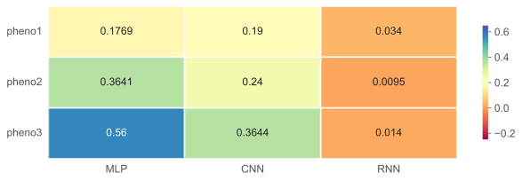

## Deep Nerual Networks for Phenotype Prediction

This project is about trying and testing deep neural networks for predicting phenotype from genotype datasets. The target is a comparison between classical machine learning models and deep neural network models in phenotype prediction. The following summarizes how the datasets look like and which models are used in this project.

### Overview - implemented models

So far, have done the implementation of MLP, CNN with Pytorch from scratch; where RNN is simply implemented with LSTM and Linear. All models are tuned using optuna.

- [x] MLP implemented by Pytorch with Additive + One-hot Encoding
- [x] CNN implemented by Pytorch with Additive + One-hot Encoding
- [x] RNN implemented by Pytorch with One-hot Encoding
- [x] Tuning models using Optuna

### Current RNN model overview

* Data input features: [`n_samples`, 10000, 4] with one-hot encoding
* Model snippet code:

```python
# Get outputs after LSTM layer
class Output_lstm(torch.nn.Module):
    def __init__(self):
        super(Output_lstm, self).__init__()

    def forward(self, x):
        lstm_out, (hn, cn) = x
        return lstm_out
# Reshaping the outputs such that it can be fit into the fully connected layer
class Reshape_to_linear(torch.nn.Module):
    def __init__(self):
        super(Reshape_to_linear, self).__init__()

    def forward(self, lstm_out):
        return lstm_out[:, -1, :]

def RNN(tuned_params):
    layers = []
    n_feature = 4 # for onehot
    if tuning_params['n_layers'] > 1:
        layers.append(LSTM(input_size=n_feature, hidden_size=tuning_params['hidden_size'],
                                num_layers=tuning_params['n_layers'], dropout=tuning_params['dropout']))
    else:
        layers.append(LSTM(input_size=n_feature, hidden_size=tuning_params['hidden_size'],
                                num_layers=tuning_params['n_layers']))
    layers.append(Output_lstm())
    layers.append(Reshape_to_linear())
    layers.append(Dropout(tuning_params['dropout']))
    layers.append(Linear(in_features=tuning_params['hidden_size'], out_features=1))

    return torch.nn.Sequential(*layers)
```

* Observation:
    + RNN is very bad at the moment with the current one-hot encoding => need another way of encoding for this model.
    + Training RNN is too slow => if we reduce the dimention of data, we can run RNN faster or not => such as UPMA, ...

* Overview the current results with the best tuned parameters for each model




### TODO

* Try to check RNN and maybe improve it further if possible - Collect results
* Complete the internship report and submit to 8/1/2024 (after holidays). 

### Question
* The phenotype dataset itself doesn't have a good match or a good correlation between the input features and the labels => any analysis method or technique to check whether a dataset can be good for training?

<!-- * Or, somehow, with a few trials, we can know or can decide better: Should we go further in tuning the model or not? -->


