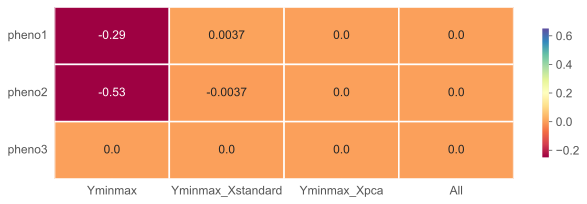

## Deep Nerual Networks for Phenotype Prediction

This project is about trying and testing deep neural networks for predicting phenotype from genotype datasets. The target is a comparison between classical machine learning models and deep neural network models in phenotype prediction. The following summarizes how the datasets look like and which models are used in this project.

### TODO with RNN, CNN, MLP implementation

Have tried to get familiar with RNN, CNN, MLP implemented by Pytorch. Now, need to implement these models as general outsources, such as
- [x] Implementing + tuning MLP with Additive + On-hot Encoding
- [x] Implementing + tuning CNN with Additive + On-hot Encoding
- [ ] Implementing + tuning RNN

<!--  -->

### 1. SNP dataset
After doing matching and eliminating NaN values:
- Dataset of pheno1: X: (500, 10000); y: (500, 1)

- Dataset of pheno2: X: (1000, 10000); y: (1000, 1)

- Dataset of pheno3: X: (2000, 10000); y: (2000, 1)

Data preprocessing (using sklearn library):
- MinMax Scaler for y => give the best result for both model MLP and CNN
- Standardization for X
- Decomposition PCA

### 2. Training Strategy
- Get independent train dataset (90% dataset) and test dataset (10% dataset):
- Run Cross-validation with 5 fold (combined with 5 epochs in each iteration)

### 3. Model architecture and Tuning model 


### 4. Results - evaluating the model in test set

####  a. MLP model: 

* Range of hyperparameters for model MLP optimization by optuna
```python
params = {
              'learning_rate': optuna_trial.suggest_float('learning_rate', 1e-6, 1e-2), 
              'optimizer': optuna_trial.suggest_categorical("optimizer", ["Adam", "SGD"]),
              'weight_decay': optuna_trial.suggest_float('weight_decay', 1e-8, 1e-2),
              'initial_outfeatures_factor': optuna_trial.suggest_float('initial_outfeatures_factor', 0.1, 0.8),
              'activation': optuna_trial.suggest_categorical('activation', ['leakyrelu', 'relu', 'tanh']),
              'n_layers' : optuna_trial.suggest_int("n_layers", 1, 5),
              'dropout' : optuna_trial.suggest_float('dropout', 0.1, 0.5, step=0.05),
              'pca': optuna_trial.suggest_float('pca', 0.7, 0.95, step=0.05)
              }
```
    => Using the best hyperparameters, the MLP prediction model was retrained on the whole training and validation data in 5-fold cross-validation.

* Performance on test data - Results of Explained variance in heatmap


(MLP with Additive Encoding)


(MLP with One-hot Encoding)

#### b. CNN model: with tuning by Optuna

* Range of hyperparameters for model CNN optimization by optuna
```python
params = {
              'learning_rate': optuna_trial.suggest_float('learning_rate', 1e-6, 1e-2), 
              'optimizer': optuna_trial.suggest_categorical('optimizer', ["Adam", "SGD"]),
              'weight_decay': optuna_trial.suggest_float('weight_decay', 1e-4, 1e-2),
              'kernel_size': optuna_trial.suggest_int("kernel_size", 2, 8),
              'stride_percentage': optuna_trial.suggest_float('stride_percentage', 0.1, 1.0, step=0.1),
              'n_layers': optuna_trial.suggest_int("n_layers", 1, 4),
              'factor_out_linear_features': optuna_trial.suggest_float('factor_out_linear_features', 0.5, 1, step=0.1),
              'activation1': optuna_trial.suggest_categorical('activation1', ['ReLU', 'LeakyReLU', 'Tanh']),
              'activation2': optuna_trial.suggest_categorical('activation2', ['ReLU', 'LeakyReLU', 'Tanh']),
              'dropout': optuna_trial.suggest_float('dropout', 0.1, 0.5),
              'pca': optuna_trial.suggest_float('pca', 0.7, 0.95, step=0.05)
              }
```
    => Using the best hyperparameters, the CNN prediction model was retrained on the whole training and validation data in 5-fold cross-validation.
* Performance on test data - Results of Explained variance in heatmap



(CNN with Additive Encoding)


(CNN with One-hot Encoding)

#### Summary:
* Only using MinMax Scaler for both model MLP and CNN: give the best result
* MLP: should use Additive Encoding 
* CNN: should use One-hot Encoding
* Increasing sample size (from pheno1(#500) -> pheno2(#1000) -> pheno3(#2000)): better prediction

=> Overall performance: MLP > CNN

### 5. Next step

* RNN implemented by Pytorch + Tuning with Optuna
* Report writing


