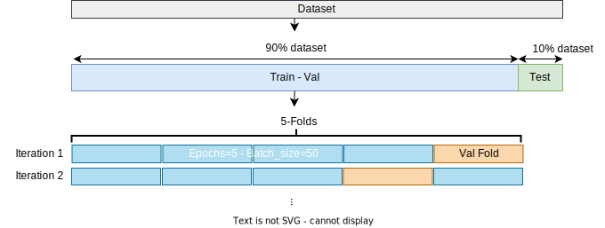
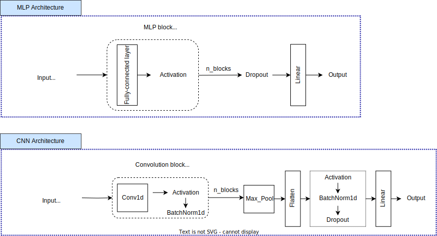

## Deep Nerual Networks for Phenotype Prediction

This project is about trying and testing deep neural networks for predicting phenotype from genotype datasets. The target is a comparison between classical machine learning models and deep neural network models in phenotype prediction. The following summarizes how the datasets look like and which models are used in this project.

### TODO with RNN, CNN, MLP implementation

Have tried to get familiar with RNN, CNN, MLP implemented by Pytorch. Now, need to implement these models as general outsources, such as
- [x] MLP implemented by Pytorch
- [x] CNN implemented by Pytorch
- [ ] RNN implemented by Pytorch

<!--  -->

### 1. Preprocessing SNP dataset

The dataset of pheno1 looks like:
X: (500, 10000); 
y: (500, 1)

```python
    sample_ids, ..., ...     pheno1
    9387, 2 0 0 2 0 0 0 ...  7.9124
    9367, 2 2 0 0 0 0 0 ...  12.654
    9356, 2 0 0 0 0 2 0 ...  8.6401
    9355, ...
```

#### Data preprocessing:

<!--  -->


* Data Standardization by Z-Score
* Min-Max Scaler for Label y
* Outliers Detection & Dimension Reduction(PCA)


### 2. Training Strategy
Get independent test dataset and train dataset:
- Train dataset(including validation): (450, 10000)
- Test set: (50,10000)

<!--  -->


### 3. Model architecture and Tuning model 




### 4. Result

* MLP model: with tuning by Optuna


(Left: MLP training loss --- Right: Prediction results)

Test - Average:   loss = 0.015, ExpVar = 0.607, R2 = 0.604, MAE = 0.098

* CNN model: not yet tuned


(Left: CNN training loss --- Right: Prediction results)

Test - Average:   loss = 0.050, ExpVar = -0.372, R2 = -0.966, MAE = 0.186

### 5. Next step
* Using One-hot encoding
* Tuning CNN model with Optuna
* RNN implemented by Pytorch + Tuning with Optuna

### 6. Questions
(1) The features dimension of X is too large (10000 features) + the matrix X only contains 0 and 2. 
* -> technique for reducing the numbers of features and extracting only the valuale features

(2) y label used Min Max Scaler -> when training model, loss MSE is very low, however the explained variance doesn't make sense. 
* -> technique for scailing y lael

(3) CNN model is mainly used for classification task.
* -> CNN architecture is specialized for regression.


